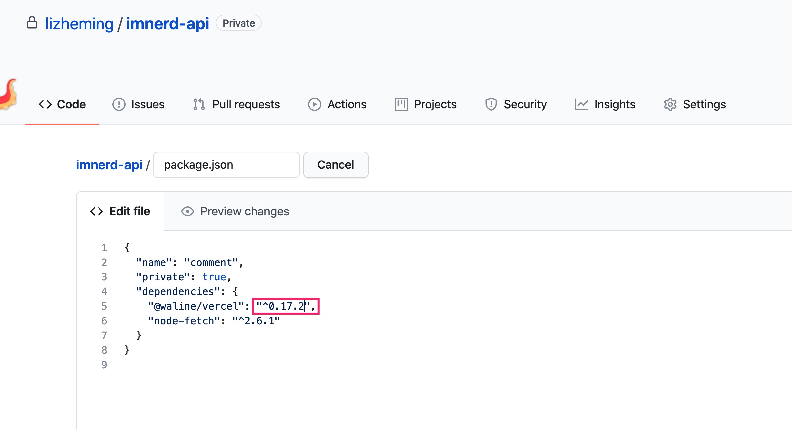
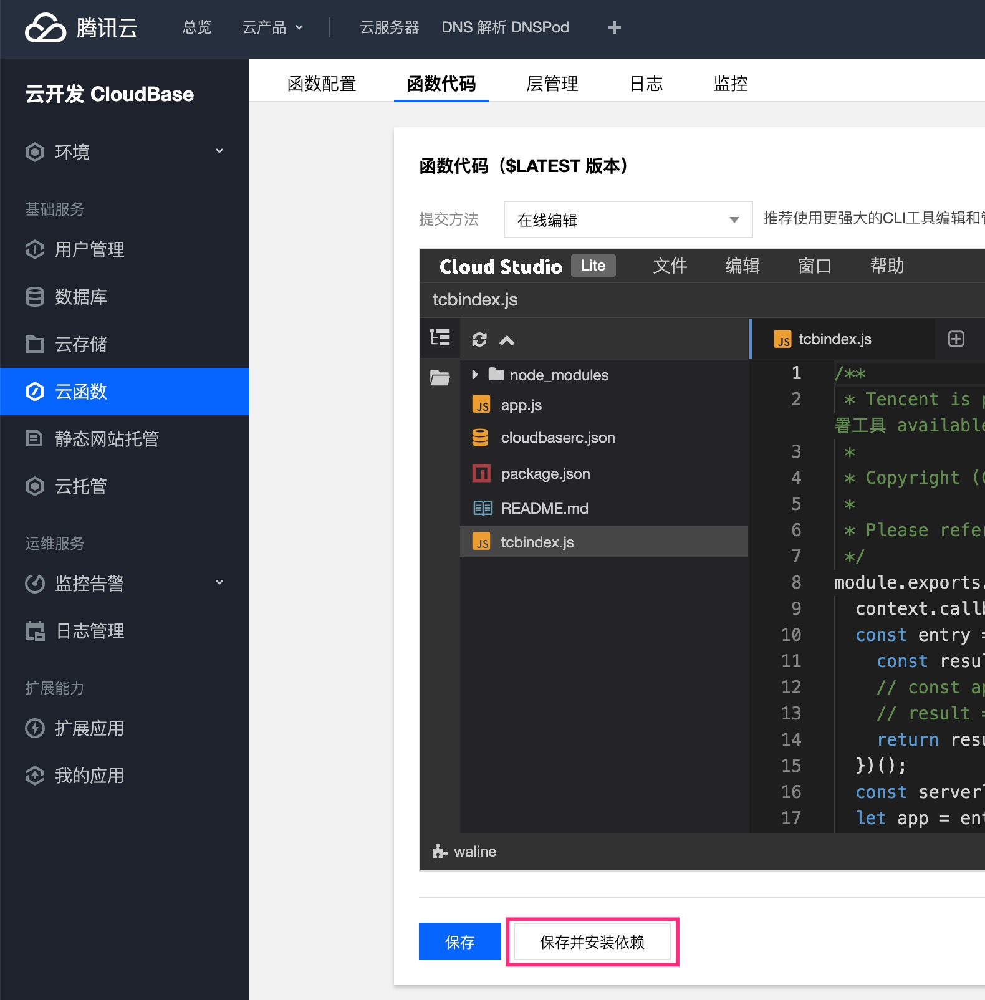

# FAQ

Waline 诞生之初就已经作了很明确的定位:

> 一款 **带后端** 的 **极简风** 评论系统。

之后发布的所有版本都是围绕这个定位的修改。

## 和 Valine 是什么关系？

Waline = **W**ith backend V**aline**

前端的评论列表使用 React 参考着 Valine 的已开源版本进行了重写，样式和结构还有内部的一些工具方法都来自 Valine。

## 是否需要在 LeanCloud 上部署 Valine-Admin？

不需要。Waline 是数据存储，服务端以及客户端三位一体的部署，其中服务端相当于 Valine 的 LeanCloud 云引擎。服务端包含了 Valine 所用云引擎提供的评论管理和邮件通知等相关的功能，不依赖额外的 LeanCloud 云引擎，所以不会受到 LeanCloud 云引擎休眠策略的限制。

## 如何升级？

Waline 主要由前端和服务端两部分组成。

### 前端

前端通过在网页引入 JS 脚本来插入评论列表和评论框。大部分场景下，链接会使用线上 CDN 最新版的地址，会自动应用最新版本，无需使用者手动更新。

::: tip 以下情形需要手动更新

1. CDN 地址中强制指定了版本号，这时候需要手动修改版本号为最新。
2. 使用了 NPM 引入最终将模块打包到了代码中，这时候需要修改依赖中的版本号保证依赖在安装的时候能获取到最新版本。

:::

### 服务端

服务端指的是在前端脚本中配置的 `serverURL` 对应的后端服务，其更新视不同的部署环境会略有区别。服务端的更新会比较频繁。

#### Vercel

进入到对应的 GitHub 仓库中，修改 package.json 文件中的 `@waline/vercel` 版本号为最新版本即可。



#### CloudBase

进入代码编辑界面，点击 <kbd>保存并重新安装依赖</kbd> 即可。如果还不行，则进入 <kbd>我的应用</kbd> 选择 <kbd>部署</kbd> 进行重新部署。

::: warning

重新部署会清空之前的文件，如果之前文件中有配置的话需要先行备份。

:::



#### Docker

直接运行 `docker pull lizheming/waline` 拉取最新的镜像即可。

## 发布评论很慢怎么办？

因为一些技术性原因，在发布评论的时垃圾邮件检测、评论通知都是串联操作。其中垃圾邮件检测使用的是国外 Akismet 提供的服务，可能访问很慢，用户可以通过 `AKISMET_KEY=false` 环境变量关闭垃圾评论检测功能。除了垃圾评论检测服务，评论通知中的邮件通知也有可能造成超时，可以通过关闭评论通知测试是否是该功能导致的。

## 如何增加灯箱效果？

有很多插件可以实现灯箱效果，这里我以 [lightGallery](https://www.lightgalleryjs.com/), [Slimbox2](https://www.digitalia.be/software/slimbox2/), [lightbox2](https://lokeshdhakar.com/projects/lightbox2/) 和 [Fancybox](https://fancyapps.com/docs/ui/fancybox/) 为例。

### lightGallery

在你的 HTML `</head>` 前写入以下内容，其中 `#waline-comment` 是你的 Waline 评论框，需要根据实际场景进行替换。

```
<link rel="stylesheet" href="https://cdn.jsdelivr.net/npm/lightgallery@2.1.5/css/lightgallery-bundle.css" />
<srciprt src="https://cdn.jsdelivr.net/npm/lightgallery@2.1.5/lightgallery.umd.min.js"></script>
<script>
document.addEventListener('click', e => {
  const imgs = [].slice.call(
    document.querySelectorAll('#waline-comment .vcontent img')
  ).filter(img => img.width > 20);

  if(imgs.indexOf(e.target) === -1) {
    return;
  }
  if(!e.target.gallery) {
    e.target.gallery = window.lightGallery(e.target.parentNode);
  }
  e.target.gallery.openGallery(0);
});
</script>
```

### Slimbox2

在你的 HTML `</head>` 前写入以下内容，其中 `#waline-comment` 是你的 Waline 评论框，需要根据实际场景进行替换。

```
<link rel="stylesheet" href="https://cdn.jsdelivr.net/gh/cbeyls/slimbox/css/slimbox2.css" />
<script src="https://cdn.jsdelivr.net/npm/jquery@1.12.4/dist/jquery.min.js"></script>
<script src="https://cdn.jsdelivr.net/gh/cbeyls/slimbox/js/slimbox2.js"></script>
<script>
document.addEventListener('click', (e) => {
  const imgs = [].slice.call(
    document.querySelectorAll('#waline-comment .vcontent img')
  ).filter(img => img.width > 20);

  const idx = imgs.indexOf(e.target);
  if(idx === -1) {
    return;
  }

  $.slimbox(e.target.src, e.target.alt, {});
});
</script>
```

### lightbox2

在你的 HTML `</head>` 前写入以下内容，其中 `#waline-comment` 是你的 Waline 评论框，需要根据实际场景进行替换。

```
<link rel="stylesheet" href="https://cdn.jsdelivr.net/npm/lightbox2@2.11.3/dist/css/lightbox.min.css" />
<script src="https://cdn.jsdelivr.net/npm/lightbox2@2.11.3/dist/js/lightbox-plus-jquery.min.js"></script>
<script>
document.addEventListener('click', e => {
  const lightbox = new Lightbox();
  const imgs = [].slice.call(
    document.querySelectorAll('#waline-comment .vcontent img')
  ).filter(img => img.width > 20);

  if(imgs.indexOf(e.target) === -1) {
    return;
  }

  const $link = $('<a />', {
    href: e.target.src,
    'data-title': e.target.alt,
    rel: 'lightbox'
  });
  lightbox.start($link);
});
</script>
```

### Fancybox

在你的 HTML `</head>` 前写入以下内容，其中 `#waline-comment` 是你的 Waline 评论框，需要根据实际场景进行替换。

```
<script src="https://cdn.jsdelivr.net/npm/@fancyapps/ui/dist/fancybox.umd.js"></script>
<link rel="stylesheet" href="https://cdn.jsdelivr.net/npm/@fancyapps/ui/dist/fancybox.css"/>
<script>Fancybox.bind('#waline-comment .vcontent img')</script>
```
